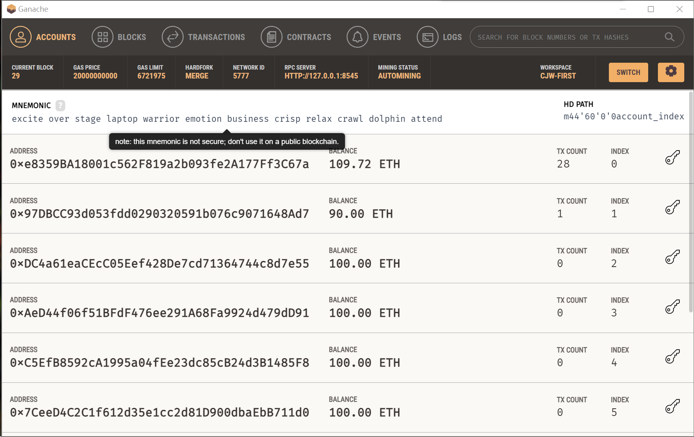
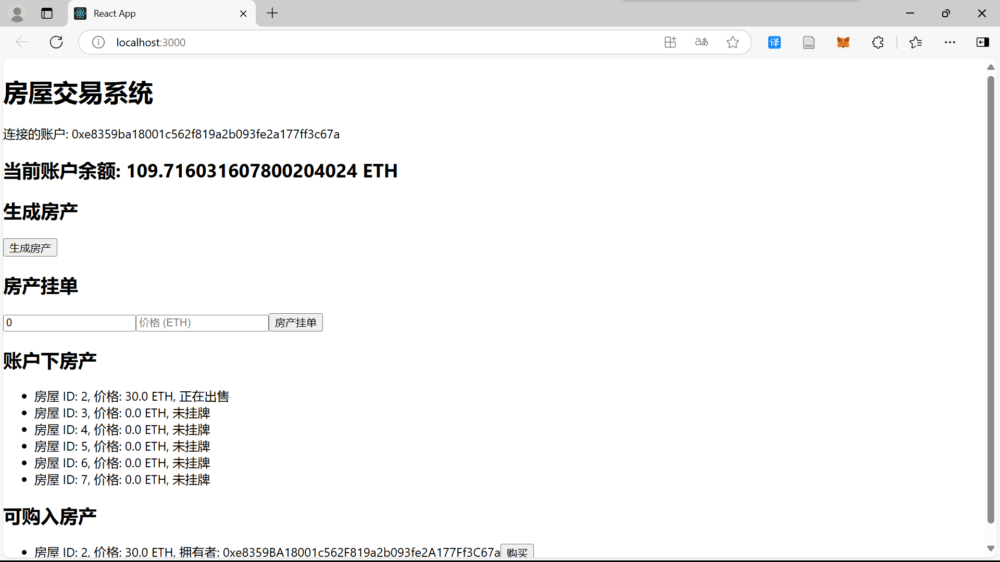

# ZJU-blockchain-course-2024

> 第二次作业要求（以下内容提交时可以删除）：
> 
> 去中心化房屋购买系统，参与方包括：房屋拥有者，有购买房屋需求的用户
>
> 建立一个简易的房屋出售系统，在网站中：
> - 创建一个（ERC721）合约，在合约中发行房屋集合，每个NFT代表一栋房屋。让部分用户免费领取部分房屋NFT，用于后面的测试。
> - 在网站中，用户可以出售，或者使用测试以太币购买房屋。每个用户可以： 
>  1. 用户查看自己拥有的房产列表。并可以挂单出售自己的房屋（挂单包含价格等信息）。
>  2. 用户查看所有出售中的房产，并查询一栋房产的主人，及各种挂单信息。
>  3. 用户选择支付房屋价格对应的测试以太币，购买某个其他用户出售的房产。购买后房产拥有权应当发生变化。
>  4. 平台收取手续费：在一个房产出售完成时，用户支付的部分测试以太币（=某栋房产在平台上的挂单时长（timestamp）* 固定比例 * 房产价格）应该被转入某个特定账户（如合约部署者）。
      。
> - （Bonus，如果想要完成Bonus，可以直接将功能整合进上述要求中）发行一个（ERC20）合约，允许用户将测试以太币兑换成ERC20积分，并使用ERC20积分完成购买房屋的流程。
> - 请大家专注于功能实现，网站UI美观程度不纳入评分标准，但要让用户能够舒适操作。简便起见，可以在网上找图片代表不同房产，不需要将图片上链。

**以下内容为作业仓库的README.md中需要描述的内容。请根据自己的需要进行修改并提交。**

作业提交方式为：**提交视频文件**和**仓库的链接**到指定邮箱。

## 如何运行

补充如何完整运行你的应用。

1. 在本地启动ganache应用，端口默认为8545，chain id为1337。

2. 在 `./contracts` 中安装需要的依赖，运行如下的命令：
    ```bash
    npm install
    ```

3. 在 `./contracts` 中编译合约，运行如下的命令：
    ```bash
    npx hardhat compile
    ```

4. 在```./contracts``` 目录下部署合约到本地测试网：

    ```bash
    npx hardhat run scripts/deploy.ts --network ganache
    ```

5. 记住部署者的地址，(BuyMyRoom depolyed to 后面的地址)，将该地址复制到````App.tsx``` 的填写地址栏

6. 在 `./frontend` 中安装需要的依赖，运行如下的命令：
    ```bash
    npm install
    ```

7. 在 `./frontend` 中启动前端程序，运行如下的命令：
    ```bash
    npm run start
    ```

## 功能实现分析

项目完成了去中心化房产管理系统的主要功能，用户可以在登录账户后使用ETH购买房屋。以下是各个功能及其实现方式。

## 项目运行截图

1. 项目启动时ganache状态如图：
   
    

2. 完成准备工作后，登录```localhost：3000```页面，可以看到这个界面，当前已经连接了小狐狸，展示了第一个账户的首页情况
    
    

3. 生成房屋，这里我点击了生成房屋，可以看到小狐狸弹出确认窗口，我选择确认。
    
    
    
4. 于是我们生成了一套新的房屋，id为6，初始状态为价格为0，未挂牌。
    
    

5. 挂单房屋，我选择挂单id为5的房产，价格为20ETH，小狐狸弹出确认窗口，我选择确认。
    
    

6. 可以看到id为5的房产价格变为20，并且挂单列表也出现了。
    
    

7. 购买房屋，我选择购买id为5的房产，此时该房屋已经是我自己的房屋，无法购买，弹出提示购买失败。
    
    

8. 此时我切换到另一个账户，在小狐狸切换后连接，可以看到连接的账户id和余额均更新，并且可以看到已经挂单的可购买的房屋。
    
    

9. 此时我选择购买id为5的房屋，小狐狸弹出确认窗口，我点击确认。
    
    

10. 购买成功，此时id为5的房屋已经进入该账户下，并且余额也减少，可购入房产减少，因为购买的房屋默认不挂单。
    
    

11. 此时我切换回第一个账户，发现余额增加了，账户下房产也减少了id为5的房产。
    
    

这里基本功能展示完毕。bonus我没有实现，平台收取手续费功能由于第一个账户就是默认收取手续费的账户，余额没有能够体现出，如果是在其他账户之间进行交易，可以看到第一个账户余额增加。


## 参考内容

- 课程的参考Demo见：[DEMOs](https://github.com/LBruyne/blockchain-course-demos)。

- 快速实现 ERC721 和 ERC20：[模版](https://wizard.openzeppelin.com/#erc20)。记得安装相关依赖 ``"@openzeppelin/contracts": "^5.0.0"``。

- 如何实现ETH和ERC20的兑换？ [参考讲解](https://www.wtf.academy/en/docs/solidity-103/DEX/)

如果有其它参考的内容，也请在这里陈列。

感言：这个作业难度真的很高，有很多步都给我造成了很大的困难，比如前端react的使用，前后端接口的实现，智能合约的方法运用，当然这些都是看得见的难度。看不见的难度更是让我非常痛苦，比如一切都已准备就绪但莫名其妙就运行不了代码报错也弹不出个所以然的迷茫，比如不知道改哪里，不知道改什么，不知道做完这一步之后该怎么操作，甚至让我有想砸电脑的冲动。最后也是在时间非常紧张的情况下（因为还有另一门课程的期末考试和大实验），勉强完成了这个实验的大致内容。也希望助教gg高抬贵手。虽然如此困难吧，但这次作业还是让我收获很多的，框架本身也比较好，实际合约内容也不算太复杂，让我们体会到了一丝区块链交易的奥秘。